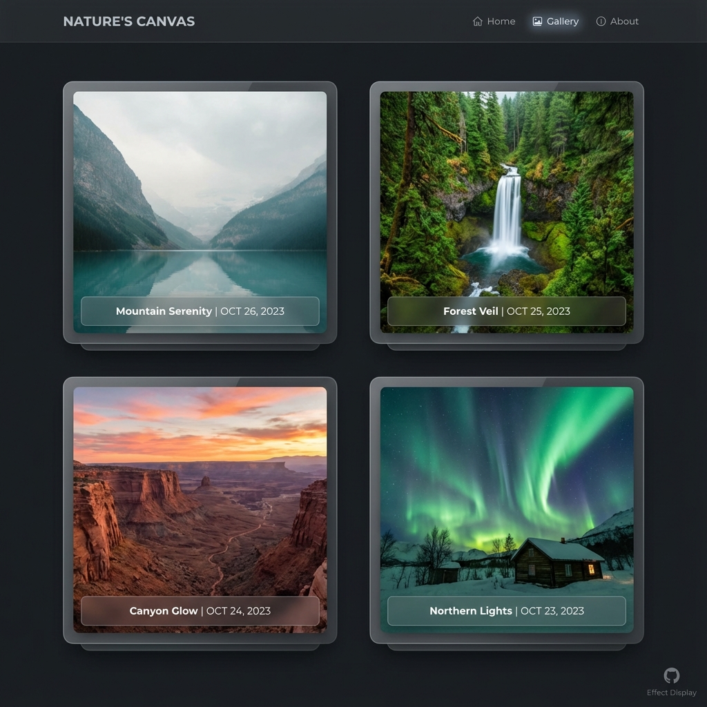

# 📅 DailyWallpaperHub

> Multi-source Wallpaper Aggregator · Auto-archive Bing + Unsplash · AI Visual Story Generation · WeChat Push · GitHub Pages Gallery

[English](README_EN.md) | [中文](README.md)

[](https://github.com/Hana19951208/DailyWallpaperHub/actions/workflows/daily.yml)
[](https://Hana19951208.github.io/DailyWallpaperHub/)

---

## ✨ Features

- **🎨 Multi-Source Aggregation**: Supports multiple wallpaper sources like Bing and Unsplash. Configurable and easy to extend.
- **⚡️ Async Architecture**: AI story generation runs asynchronously. Main process is fast, making images available immediately.
- **🤖 AI Visual Stories**: Integrated with LLM visual models to auto-generate exquisite cultural stories (approx. 500 words) for each wallpaper.
- **📝 Externalized Prompts**: AI prompts stored in `prompts/story_prompt.txt` for easy customization.
- **⏰ Smart Scheduling**: GitHub Actions checks for updates every hour to get the latest wallpapers ASAP.
- **💾 Persistent Archiving**: High-res images, thumbnails, metadata (JSON), and AI stories are auto-committed to the repo, never lost.
- **🎭 Modern Gallery**: Built-in GitHub Pages gallery with responsive design and dark mode.
- **📱 WeChat Push**: Automatically pushes images, metadata, and AI stories to Enterprise WeChat groups (Markdown supported).
- **🎯 Quantity Limit**: Default index shows only the last 10 days to avoid clutter (adjustable in `config/sources.yaml`).
- **🛠 Batch Tools**: Supports batch fetching of historical wallpapers by date and source.
- **💰 Zero Cost**: Built entirely on free GitHub resources.

---

## 🖼 Showcase

### Online Gallery



### AI Stories (Click Title to Read)
Click the title in the wallpaper index to jump to the AI-generated background story (includes original image display).

---

## 📅 Wallpaper Index (Latest)

<!-- WALLPAPER_INDEX_START -->
<table width="100%">
<tr><th width="15%">日期</th><th width="42%">Bing 🔍</th><th width="42%">Unsplash 📷</th></tr>
<tr>
<td align="center"><b>2025-12-18</b></td>
<td align="center" valign="top"><a href="docs/wallpapers/bing/2025-12-18/image.jpg"></a><br /><a href="docs/wallpapers/bing/2025-12-18/story.md"><small>高山的悠久历史 📖</small></a></td>
<td align="center" valign="top"><a href="docs/wallpapers/unsplash/2025-12-18/image.jpg"></a><br /><a href="docs/wallpapers/unsplash/2025-12-18/story.md"><small>a view of the mountains from the top of a hill 📖</small></a></td>
</tr>
<tr>
<td align="center"><b>2025-12-17</b></td>
<td align="center" valign="top"><a href="docs/wallpapers/bing/2025-12-17/image.jpg"></a><br /><a href="docs/wallpapers/bing/2025-12-17/story.md"><small>犹他州的时光层叠 📖</small></a></td>
<td align="center" valign="top"><a href="docs/wallpapers/unsplash/2025-12-17/image.jpg"></a><br /><a href="docs/wallpapers/unsplash/2025-12-17/story.md"><small>a lush green hillside covered in lots of moss 📖</small></a></td>
</tr>
<tr>
<td align="center"><b>2025-12-16</b></td>
<td align="center" valign="top"><a href="docs/wallpapers/bing/2025-12-16/image.jpg"></a><br /><a href="docs/wallpapers/bing/2025-12-16/story.md"><small>皮毛、霜冻和盛宴 📖</small></a></td>
<td align="center" valign="top"><a href="docs/wallpapers/unsplash/2025-12-16/image.jpg"></a><br /><a href="docs/wallpapers/unsplash/2025-12-16/story.md"><small>Vista panoramica 📖</small></a></td>
</tr>
<tr>
<td align="center"><b>2025-12-15</b></td>
<td align="center" valign="top"><a href="docs/wallpapers/bing/2025-12-15/image.jpg"></a><br /><a href="docs/wallpapers/bing/2025-12-15/story.md"><small>小帽子，大能量 📖</small></a></td>
<td align="center" valign="top"><a href="docs/wallpapers/unsplash/2025-12-15/image.jpg"></a><br /><a href="docs/wallpapers/unsplash/2025-12-15/story.md"><small>a rock in the middle of a body of water 📖</small></a></td>
</tr>
<tr>
<td align="center"><b>2025-12-14</b></td>
<td align="center" valign="top"><a href="docs/wallpapers/bing/2025-12-14/image.jpg"></a><br /><a href="docs/wallpapers/bing/2025-12-14/story.md"><small>静谧水波，闪耀灯影 📖</small></a></td>
<td align="center" valign="top"><a href="docs/wallpapers/unsplash/2025-12-14/image.jpg"></a><br /><a href="docs/wallpapers/unsplash/2025-12-14/story.md"><small>brown mountains under white clouds during daytime 📖</small></a></td>
</tr>
<tr>
<td align="center"><b>2025-12-13</b></td>
<td align="center" valign="top"><a href="docs/wallpapers/bing/2025-12-13/image.jpg"></a><br /><a href="docs/wallpapers/bing/2025-12-13/story.md"><small>假日鸟类大比拼 📖</small></a></td>
<td align="center" valign="top"><a href="docs/wallpapers/unsplash/2025-12-13/image.jpg"></a><br /><a href="docs/wallpapers/unsplash/2025-12-13/story.md"><small>We could take a 5-minute walk from our Airbnb to visit the Banasura Sagar lake. It was a routine on most evenings. And during sunset, along with the mist, the mountains, and calm water, it would form the most beautiful and picturesque moment.  📖</small></a></td>
</tr>
<tr>
<td align="center"><b>2025-12-12</b></td>
<td align="center" valign="top"><a href="docs/wallpapers/bing/2025-12-12/image.jpg"></a><br /><a href="docs/wallpapers/bing/2025-12-12/story.md"><small>冰封的倒影 📖</small></a></td>
<td align="center" valign="top"><a href="docs/wallpapers/unsplash/2025-12-12/image.jpg"></a><br /><a href="docs/wallpapers/unsplash/2025-12-12/story.md"><small>a field with tall grass and trees in the background 📖</small></a></td>
</tr>
<tr>
<td align="center"><b>2025-12-11</b></td>
<td align="center" valign="top"><a href="docs/wallpapers/bing/2025-12-11/image.jpg"></a><br /><a href="docs/wallpapers/bing/2025-12-11/story.md"><small>点亮节日的红色植物 📖</small></a></td>
<td align="center" valign="top"><a href="docs/wallpapers/unsplash/2025-12-11/image.jpg"></a><br /><a href="docs/wallpapers/unsplash/2025-12-11/story.md"><small>a large waterfall with water pouring out of it 📖</small></a></td>
</tr>
<tr>
<td align="center"><b>2025-12-10</b></td>
<td align="center" valign="top"><a href="docs/wallpapers/bing/2025-12-10/image.jpg"></a><br /><a href="docs/wallpapers/bing/2025-12-10/story.md"><small>天地相接之处 📖</small></a></td>
<td align="center" valign="top"><a href="docs/wallpapers/unsplash/2025-12-10/image.jpg"></a><br /><a href="docs/wallpapers/unsplash/2025-12-10/story.md"><small>a river running through a valley surrounded by mountains 📖</small></a></td>
</tr>
<tr>
<td align="center"><b>2025-12-09</b></td>
<td align="center" valign="top"><a href="docs/wallpapers/bing/2025-12-09/image.jpg"></a><br /><a href="docs/wallpapers/bing/2025-12-09/story.md"><small>文化交汇之地 📖</small></a></td>
<td align="center" valign="top"><a href="docs/wallpapers/unsplash/2025-12-09/image.jpg"></a><br /><a href="docs/wallpapers/unsplash/2025-12-09/story.md"><small>a small island in the middle of a lake 📖</small></a></td>
</tr>
</table>
<!-- WALLPAPER_INDEX_END -->

---

## 🚀 Quick Start

### Local Development

```bash
# 1. Clone repository
git clone https://github.com/Hana19951208/DailyWallpaperHub.git
cd DailyWallpaperHub

# 2. Install dependencies (using conda env)
conda activate base
pip install -r requirements.txt

# 3. Configure Environment Variables
cp .env.example .env
# Edit .env file with your configurations:
# WEWORK_WEBHOOK=your_webhook_url
# LLM_API_KEY=your_api_key
# LLM_BASE_URL=https://api.openai.com/v1
# LLM_MODEL_NAME=gpt-4o
# UNSPLASH_ACCESS_KEY=your_unsplash_key

# 4. Fast Fetch (Skip Story)
python fetch_bing_wallpaper.py --skip-story
python fetch_unsplash_wallpaper.py --skip-story

# 5. Async Story Generation (Background)
python scripts/generate_missing_stories.py

# 6. Batch Fetch History
python batch_fetch.py bing 2025-12        # Fetch Bing whole month
python batch_fetch.py unsplash 2025-12-10 # Fetch Unsplash specific date
```

### GitHub Actions Deployment

1. **Fork this repository**

2. **Configure GitHub Secrets** (Settings → Secrets and variables → Actions):
   - `WEWORK_WEBHOOK`: Enterprise WeChat Robot Webhook URL
   - `LLM_API_KEY`: LLM API Key
   - `LLM_BASE_URL`: LLM API Base URL
   - `LLM_MODEL_NAME`: LLM Model Name
   - `UNSPLASH_ACCESS_KEY`: Unsplash API Access Key

3. **Enable GitHub Pages**:
   - Settings → Pages
   - Source: Deploy from a branch
   - Branch: `main` / `docs`

4. **Trigger manually or wait for schedule**:
   - Actions → Daily Wallpaper Fetch → Run workflow

---

## 📁 Project Structure

```
DailyWallpaperHub/
├── config/
│   └── sources.yaml          # Data Source Config
├── prompts/
│   └── story_prompt.txt      # AI Prompt Template
├── scripts/
│   ├── fill_unsplash_dec.py  # Unsplash Data Fill Script
│   └── generate_missing_stories.py  # Async Story Gen Script
├── src/
│   ├── config_loader.py      # Config Loader
│   ├── utils.py              # WeChat Push Utils
│   ├── update_readme.py      # README Updater
│   └── update_gallery.py     # Gallery Updater
├── docs/
│   ├── index.html            # GitHub Pages Gallery
│   └── wallpapers/           # 404 Fix: Wallpapers must be here for Pages
│       ├── bing/
│       │   └── YYYY-MM-DD/
│       │       ├── image.jpg
│       │       ├── thumb.jpg
│       │       ├── meta.json
│       │       └── story.md
│       └── unsplash/
│           └── YYYY-MM-DD/
│               ├── image.jpg
│               ├── thumb.jpg
│               ├── meta.json
│               └── story.md
├── .github/workflows/
│   └── daily.yml             # Automation Workflow
├── fetch_bing_wallpaper.py   # Bing Fetcher
├── fetch_unsplash_wallpaper.py # Unsplash Fetcher
├── batch_fetch.py            # Batch Tool
├── requirements.txt          # Python Dependencies
└── README.md                 # Documentation
```

---

## 🎯 Usage Guide

### Async Story Generation

To improve user experience, this project uses an asynchronous architecture:

1. **Fast Mode** (Default/Recommended):
   ```bash
   python fetch_bing_wallpaper.py --skip-story
   ```
   - Downloads images and metadata only
   - Immediately updates README and Gallery
   - Images viewable instantly

2. **Background Story Generation**:
   ```bash
   python scripts/generate_missing_stories.py
   ```
   - Scans for wallpapers missing stories
   - Batch calls LLM to generate stories
   - Auto-updates metadata and pages

### Batch Fetching

```bash
# Fetch Bing Wallpapers
python batch_fetch.py bing 2025-12        # Whole Month
python batch_fetch.py bing 2025-12-10     # Specific Date

# Fetch Unsplash Wallpapers
python batch_fetch.py unsplash 2025-12    # Whole Month (Multiple Featured)
python batch_fetch.py unsplash 2025-12-10 # Specific Date

# Source Case Insensitive
python batch_fetch.py BING 2025-12
python batch_fetch.py Unsplash 2025-12-10
```

### Adding New Sources

1. Edit `config/sources.yaml`:
   ```yaml
   sources:
     - name: new_source
       display_name: "New Source 🎨"
       enabled: true
       api_key_env: "NEW_SOURCE_API_KEY"
       fetcher_script: "fetch_new_source.py"
   ```

2. Create `fetch_new_source.py` fetcher script

3. Run tests and commit

---

## 🤝 Follow Me


> Scan to follow "Knowledge into System" (把知识变成系统)

## ⚖️ License

MIT License. For learning and exchange only. Wallpaper copyrights belong to Bing and Unsplash.
